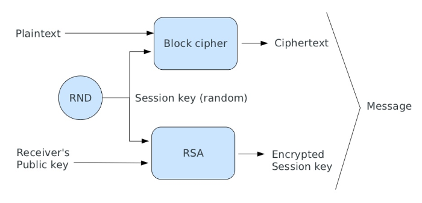

# Encrypt and decrypt using hybrid cryptosystem

Hybrid is an encryption mode that uses symmetric and public keys ciphers together.
The idea is to take the advantages of the public key cryptography for sharing the
keys and the speed of symmmetric encryption to encrypt the message.

The hybrid mode is able to encrypt message for one or more receivers and can be
used in multi user scenario, where you can limit the decryption only for some users.

## How it works

Suppose we have two users: *Alice* and *Bob*. *Alice* wants to send a message to *Bob*
using an hybrid cryptosystem, she needs to:

- Obtain *Bob*'s public key;
- Generates a random session key (one-time pad);
- Encrypts the message using a symmetric cipher with the previous session key;
- Encrypts the session key using the *Bob*'s public key;
- Send both of these encryptions to *Bob*.

A schema of the encryption is reported in the image below:



To decrypt the message *Bob* needs to:

- Uses his private key to decrypt the session key;
- Uses this session key to decrypt the message.

## Example of usage

In order to use the `Zend\Crypt\Hybrid` component you need to have a keyring of
public and private keys. To encrypt a message you can use the following code:

```php
use Zend\Crypt\Hybrid;
use Zend\Crypt\PublicKey\RsaOptions;

// Generate public and private key
$rsaOptions = new RsaOptions([
    'pass_phrase' => 'test'
]);
$rsaOptions->generateKeys([
    'private_key_bits' => 4096
]);
$publicKey  = $rsaOptions->getPublicKey();  
$privateKey = $rsaOptions->getPrivateKey();

$hybrid     = new Hybrid();
$ciphertext = $hybrid->encrypt('message', $publicKey);
$plaintext  = $hybrid->decrypt($ciphertext, $privateKey);

printf($plaintext === 'message' ? "Success\n" : "Error\n");
```

We generated the keys using the [Zend\Crypt\PublicKey\RsaOptions](public-key.md)
component. You can also use a [PEM](https://en.wikipedia.org/wiki/Privacy-enhanced_Electronic_Mail)
strings for the keys. If you use a string for the private key you need to pass
the pass-phrase for decrypt, if present, like in the following example:

```php
use Zend\Crypt\Hybrid;
use Zend\Crypt\PublicKey\RsaOptions;

// Generate public and private key
$rsaOptions = new RsaOptions([
    'pass_phrase' => 'test'
]);
$rsaOptions->generateKeys([
    'private_key_bits' => 4096
]);
// Strings in PEM format
$publicKey  = $rsaOptions->getPublicKey()->toString();
$privateKey = $rsaOptions->getPrivateKey()->toString();

$hybrid     = new Hybrid();
$ciphertext = $hybrid->encrypt('message', $publicKey);
$plaintext  = $hybrid->decrypt($ciphertext, $privateKey, 'test'); // pass-phrase

printf($plaintext === 'message' ? "Success\n" : "Error\n");
```

The `Hybrid` component uses the `Zend\Crypt\BlockCipher` for the symmetric
cipher and the `Zend\Crypt\Rsa` for the public-key cipher.

## Encrypt with multiple keys

The `Zend\Crypt\Hybrid` component can be used to encrypt a message for multiple
users, using a keyring of Ids and public keys. This keyring can be specified using
an array of `[ 'id' => 'publickey' ]`, where `publickey` can be a string (PEM)
or an instance of `Zend\Crypt\PublicKey\Rsa\PublicKey`. The `id` can be any
string, for instance the email address of the users.

Here is reported an example of encryption using a keyring of 4 keys:

```php
use Zend\Crypt\Hybrid;
use Zend\Crypt\PublicKey\RsaOptions;

$publicKeys  = [];
$privateKeys = [];
for ($id = 0; $id < 4; $id++) {
    $rsaOptions = new RsaOptions([
        'pass_phrase' => "test-$id"
    ]);
    $rsaOptions->generateKeys([
        'private_key_bits' => 4096
    ]);
    $publicKeys[$id]  = $rsaOptions->getPublicKey();
    $privateKeys[$id] = $rsaOptions->getPrivateKey();
}

$hybrid    = new Hybrid();
$encrypted = $hybrid->encrypt('message', $publicKeys);
for ($id = 0; $id < 4; $id++) {
    $plaintext = $hybrid->decrypt($encrypted, $privateKeys[$id], null, $id);
    printf($plaintext === 'message' ? "Success on %d\n" : "Error on %d\n", $id);
}
```
